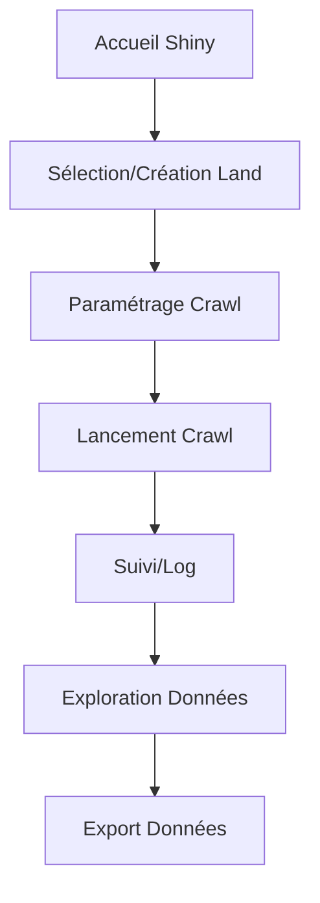

# Workflow Shiny mwiR : De la collecte (crawl) à l’export

## 0. Une roue indenté pour rentrer les crédentiel dans un fichier .env

## 1. Sélection ou création d’un “land” (projet de recherche)
- **But** : Organiser les campagnes de collecte par projet.
- **UI** : Liste déroulante des lands existants + bouton “Créer un nouveau land” avec tous les paramettres name, description, mots cles (terms), etc.
- **Backend** : Utilisation des fonctions `listlands()`, `create_land()`.

## 2. Paramétrage du crawl
- **But** : Définir la cible et les modalités de la collecte.
Soit upload un fichier.txt, soit copier coller une liste d'url, soit lancer un crawl dans un des moteurs de recherche
- **UI** :
  - Champ(s) pour saisir une ou plusieurs URLs de départ.
  - Options avancées : profondeur, nombre max de pages, filtres de domaine, choix du moteur (Google, Bing, DuckDuckGo), etc.
  - Sélecteur du land cible (prérempli à partir de l’étape 1).
- **Backend** : Appel à `crawlurls()` ou `crawlDomain()` selon le mode choisi.

## 3. Lancement et suivi du crawl
- **But** : Démarrer la collecte et informer l’utilisateur de la progression.
- **UI** :
  - Bouton “Lancer le crawl”.
  - Affichage d’une barre de progression ou d’un log en temps réel.
- **Backend** : Exécution asynchrone du crawl, gestion des erreurs, logs.

## 4. Exploration et visualisation des données collectées
- **But** : Permettre à l’utilisateur d’explorer les résultats.
- **UI** :
  - Tableau interactif des pages collectées (titre, URL, date, statut, etc.).
  - Filtres par domaine, date, statut, etc.
  - Visualisation réseau (optionnelle) : graphe des liens entre pages/sites.
- **Backend** : Lecture de la base SQLite via les fonctions d’extraction du package.

## 5. Export des données
- **But** : Permettre l’extraction des résultats pour analyse externe.
- **UI** :
  - Sélecteur de format (CSV, GEXF…).
  - Bouton “Exporter”.
- **Backend** : Appel à `export_land()`, `export_fullpagecsv()`, `export_nodegexf()`, etc.

---

## Résumé du flux utilisateur (User Journey)

---

## Points d’attention techniques

- **Modularité** : Chaque étape doit être un module Shiny indépendant pour faciliter la maintenance.
- **Robustesse** : Gestion des erreurs et des cas limites (ex : crawl sans résultat, base inaccessible…).
- **Interopérabilité** : Respect des conventions R et intégration fluide avec les fonctions mwiR.
- **Tests** : Prévoir des tests unitaires pour chaque module serveur.
- **Documentation** : Chaque module doit être documenté (usage, paramètres, exemples).
